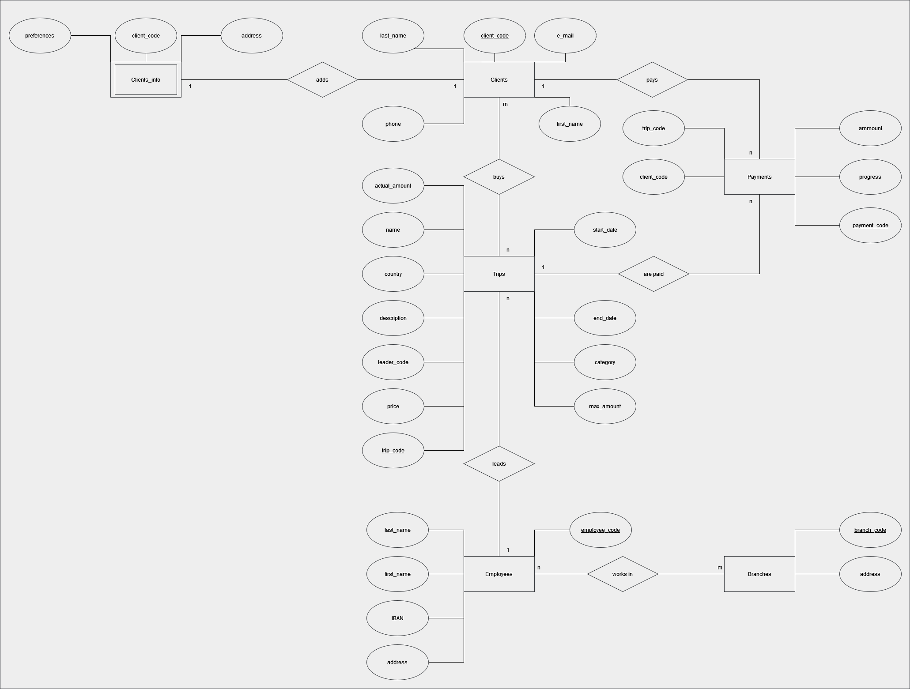

# ERD traveller
ER diagram for database that will be used to create website for tours all around the wolrd. It is a basic interpretation, it is still under construction.
Diagram was created with [diagrams.net]. T-SQL code include creating db, tables and inserting values.

Application is right now in progress, it'll be made with Python.

  

[diagrams.net]: https://app.diagrams.net/
